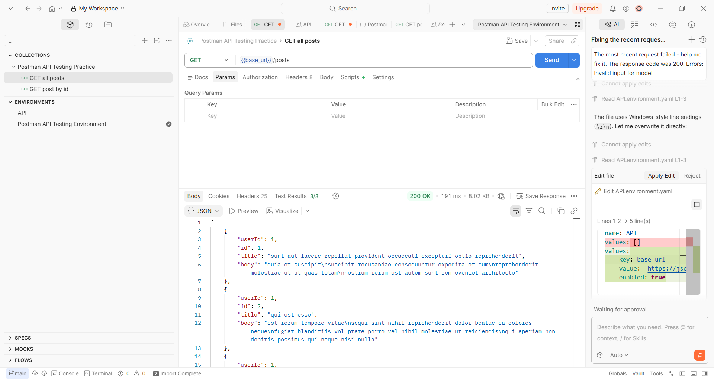
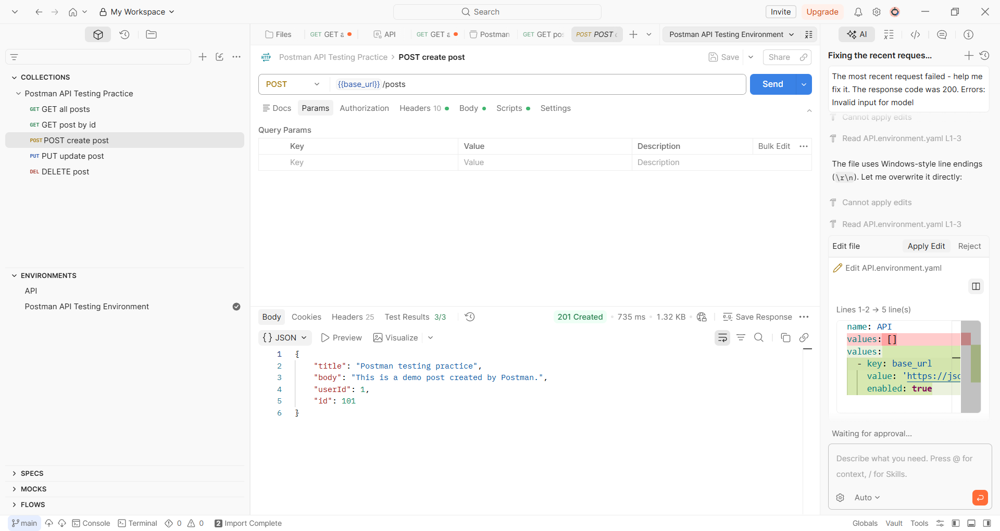
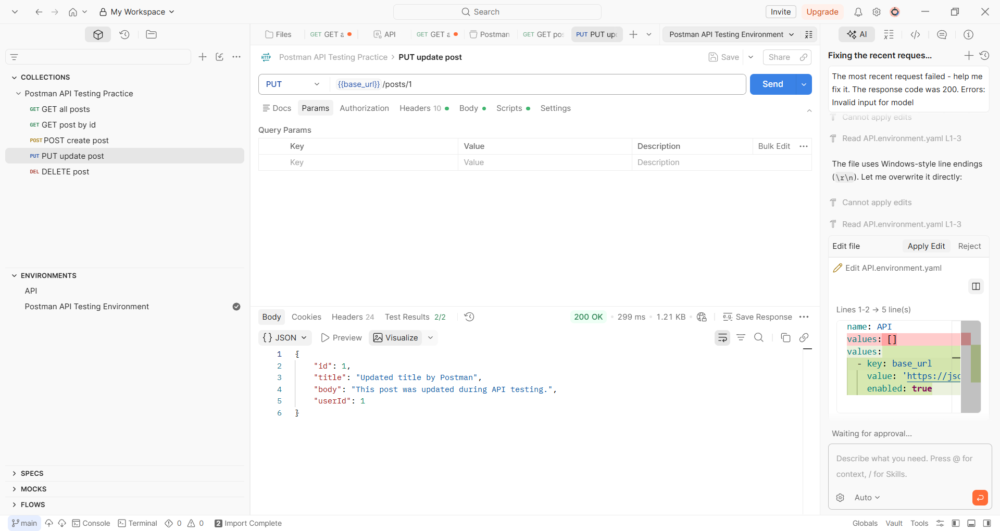
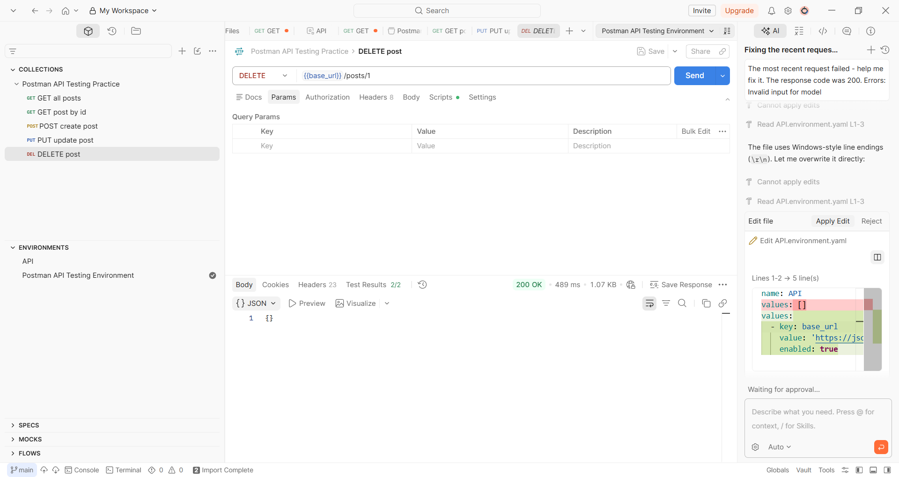

# Báo cáo thực hành Postman API Testing

## Thông tin sinh viên

- Họ và tên: Đặng Anh Tuyền
- Mã sinh viên: 23010912

## Mô tả bài thực hành

Bài thực hành sử dụng Postman để kiểm thử API mẫu của JSONPlaceholder.
Collection kiểm thử các thao tác cơ bản với tài nguyên `posts`, bao gồm:

- `GET /posts`
- `GET /posts/1`
- `POST /posts`
- `PUT /posts/1`
- `DELETE /posts/1`

## Tệp trong bài nộp

- `Postman_API_Testing_Practice.postman_collection.json`: Collection Postman chứa các request và test script.
- `Postman_API_Testing_Environment.postman_environment.json`: Environment Postman, khai báo biến `base_url`.
- `images/`: Thư mục chứa ảnh kết quả chạy API trên Postman.

## Environment

| Biến | Giá trị |
| --- | --- |
| `base_url` | `https://jsonplaceholder.typicode.com` |

## Kết quả kiểm thử

| STT | Request | Endpoint | Kết quả mong đợi |
| --- | --- | --- | --- |
| 1 | GET all posts | `GET {{base_url}}/posts` | Trả về status `200`, response là mảng, thời gian phản hồi dưới `1000ms`. |
| 2 | GET post by id | `GET {{base_url}}/posts/1` | Trả về status `200`, `id = 1`, response có các trường `id`, `title`, `body`, `userId`. |
| 3 | POST create post | `POST {{base_url}}/posts` | Trả về status `201`, response có `id`, title đúng dữ liệu gửi lên. |
| 4 | PUT update post | `PUT {{base_url}}/posts/1` | Trả về status `200`, title được cập nhật thành công. |
| 5 | DELETE post | `DELETE {{base_url}}/posts/1` | Trả về status `200`, response là object. |

## Ảnh kết quả báo cáo

### GET

### POST

### PUT

### DELETE

## Cách chạy lại

1. Mở Postman.
2. Import file `Postman_API_Testing_Practice.postman_collection.json`.
3. Import file `Postman_API_Testing_Environment.postman_environment.json`.
4. Chọn environment `Postman API Testing Environment`.
5. Chạy từng request hoặc chạy toàn bộ collection để xem kết quả test.
